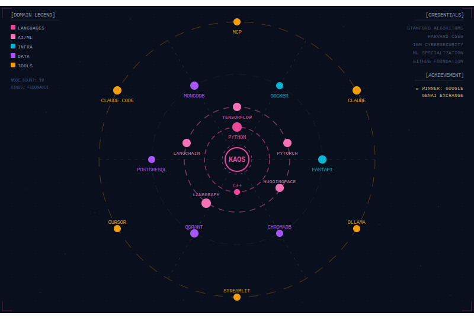

  
   

  

  
  
  
  

 

<!-- Plain-text about — always visible even without SVG rendering -->

  <strong>AI/ML Engineer & Agent Architect</strong> · Building agentic systems with LangGraph, MCP, and vector memory 
  <!-- TODO: Update with your details -->
  B.Tech Computer Science · Vellore Institute of Technology · Class of 2026 
  <em>Google GenAI Exchange Hackathon Winner </em> 
  <!-- Uncomment when actively looking: -->
  <!-- <strong>Open to ML Engineering / AI Agent roles — internship or full-time</strong> -->

 

  

  

 

  

  

 

  

  

 

  

  
   
  
   
  
   
  
   
  
   
  
    
  

 

  

### // The Build Philosophy

The tools I can't stop thinking about share one property: they make you feel something before they explain themselves. The interface communicates intent. The system has a point of view. The experience is inseparable from the function.

Most software solves the problem and calls it done. I want the version that also makes you go — *oh, this was built by someone who actually thought about this.*

That means different things depending on what I'm building:

| If it's an **agent system** | It shouldn't just work — it should be legible. You should be able to watch it think. State transitions, memory writes, tool calls — LangGraph makes the architecture *the product*. |
| :--- | :--- |
| If it's an **ML model** | The loss curve is aesthetic. Watching a model learn to separate signal from noise is one of the most satisfying things I know. I care about what the architecture is doing at every layer, not just the final metric. |
| If it's an **interface** | The terminal is enough canvas. Dense information, monospace type, a palette that doesn't apologize — if it looks like a cockpit, it probably works like one. |
| If it's a **backend** | It should be invisible in the right way. No drama, no surprises, fast enough that the frontend never has to apologize for it. MCP protocol, FastAPI — tools that stay out of the way. |

The constraint I keep coming back to: **a beautiful thing that doesn't solve the problem is art. A solution that's ugly is a missed opportunity.** I want both, every time.

---

### ∞ The Eternal Curiosity Problem

I have a condition. It starts with one question — *why does attention scale like this?* — and three hours later I'm reading a 1976 paper on Byzantine fault tolerance wondering if distributed consensus has anything useful to say about multi-agent routing. (It does.)

Some rabbit holes I've genuinely gone down: why transformers work when the theoretical guarantees are so weak · whether human memory consolidation during sleep maps to agent memory architectures · what makes a color palette *actually* good · the geometry of high-dimensional vector spaces and why cosine similarity is weirder than it looks.

> *"The test of a first-rate intelligence is the ability to hold two opposed ideas in mind at the same time and still retain the ability to function."* — F. Scott Fitzgerald, unknowingly describing debugging at 2am.

 

  

### System Telemetry

  <table border="0" cellpadding="0" cellspacing="0">
    <tr>
      <td align="center">
        
      </td>
      <td align="center">
        
      </td>
    </tr>
    <tr>
      <td colspan="2" align="center">
         
        
      </td>
    </tr>
  </table>

 

  <picture>
    <source media="(prefers-color-scheme: dark)" srcset="https://raw.githubusercontent.com/Kaos599/Kaos599/output/snake.svg?palette=github-dark">
    <source media="(prefers-color-scheme: light)" srcset="https://raw.githubusercontent.com/Kaos599/Kaos599/output/snake.svg">
    
  </picture>

 

  

