  
   
  
  
  
  
  

 

  <!-- Cybernetic ASCII Core -->
  

 

  <!-- Interactive Terminal & Easter Egg -->
  

---

### 💻 System Telemetry

  <table border="0" cellpadding="0" cellspacing="0">
    <tr>
      <td align="center">
        
      </td>
      <td align="center">
        
      </td>
    </tr>
    <tr>
      <td colspan="2" align="center">
         
        
      </td>
    </tr>
  </table>

---

  

---

### 🧠 My Core Stack

| Technology | What I do with it |
| :--- | :--- |
| **Python** | If Python were a language, I'd speak it better than English. |
| **TensorFlow & PyTorch** | The keys to unlocking my RTX 3060. |
| **LangChain & LangGraph** | Giving LLMs a mind of their own. Agentic workflows run my life. |
| **ChromaDB & Qdrant** | Remembering everything an LLM forgets (which is a lot). |
| **FastAPI** | Fast, robust, and straight to the point. The only backend I need. |
| **Docker** | Because "It works on my machine" is not an excuse. |
| **Next.js & React** | For when I inevitably have to build a frontend to show off the backend. |
| **Shadcn UI & Tailwind** | Making things look good without wanting to pull my hair out. |

---

  

---

### 🚀 Agentic Systems & Projects

  
   
  
   
  
   
  
   
  
   
  

---

### 📜 Certifications & Achievements

* **🏆 Winner:** Google GenAI Exchange Hackathon (For Project Cascade)
* **🏆 Top 5 Team:** Build with AI Hackathon (TCS + Google)
* **🏆 Internal Rounds Finalist:** Smart India Hackathon (SIH)
* **Algorithm Specialization** - *Stanford University*
* **Cloud Computing Specialization** - *UIUC*
* **Cybersecurity Fundamentals** - *IBM*
* **GitHub Foundation Certification** - *GitHub*

---

### 🛠️ Services I Offer

* **Model Creation & Fine-tuning**: Crafting custom AI solutions that don't just "talk" but actually solve hyper-specific domain problems.
* **Agentic Workflows**: Building LLM swarms (using LangGraph/LangChain) that autonomously gather data, reason, and execute tasks. 
* **Data Scraping & Synthetic Generation**: Building reliable pipelines for chaotic web data and generating robust synthetic datasets for ML training.

 

  

